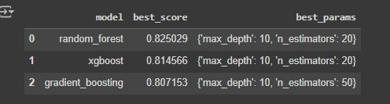
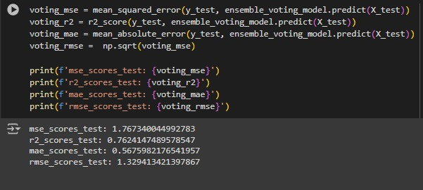

# Container Usage Prediction Model

## Project Overview

This project aims to predict the total number of containers that will be used by customers during a voyage. The dataset contains features related to container shipments such as:

- **Route of the ship**: The path taken by the vessel.
- **Ship type**: The classification of the ship.
- **Customer segmentation**: The customer category based on business types.
- **Container type**: The category of containers requested.
- **Total booked containers**: The number of containers initially booked by the customer.
- **Goods loaded**: The types of goods that will be shipped in the containers.

The goal is to predict the number of containers used, which may differ from the number initially booked.

## Methodology

An ensemble method was employed, combining the strengths of three different models:

1. **XGBoost** - A highly efficient gradient boosting model that handles sparse data and non-linear relationships well.
2. **Random Forest** - A robust and flexible model that performs well in predicting outcomes by averaging results from many decision trees.
3. **Gradient Boosting** - Another boosting technique that builds models sequentially, minimizing prediction errors.

Each of these models was tuned individually using **GridSearchCV** to find the best hyperparameters for the task. The final predictions are made by averaging the results of these three models.

Here is the metrics result of each of those models:

Here is the best model and with its best hyperparameter found with GridSearchCV, the score is R-Squared:

Here is the metrics for the ensemble model:

the metrics result for the ensemble model might not show any significant improvement, but we are working to improve the model

## Data

The dataset includes the following key features:

- **Route of the ship**
- **Ship type**
- **Customer segmentation**
- **Container type**
- **Total booked containers**
- **Goods loaded**

These features were preprocessed and fed into the models for prediction.

## Model Training

1. **Feature Engineering**:
   - Features were extracted and transformed as necessary, including handling missing values and encoding categorical data.
   
2. **Hyperparameter Tuning**:
   - Each model (XGBoost, Random Forest, Gradient Boosting) was individually tuned using GridSearchCV to find the optimal hyperparameters.
   
3. **Ensemble Method**:
   - The final prediction was made using an ensemble technique by averaging the predictions from the three models.
   
4. **Model Evaluation**:
   - The models were evaluated using common regression metrics such as Mean Squared Error (MSE), Mean Absolute Error (MAE), and R-squared (R²) to determine their performance.

## Results

- The ensemble method outperformed each individual model in terms of prediction accuracy.
- The final model provides a more stable and accurate prediction for the total number of containers used.

## Usage

This model is designed for internal use within the company to help optimize shipping logistics and improve resource planning based on customer requests.

## Future Work

- Further feature engineering could enhance the predictive power of the model.
- Implementing real-time predictions and integration into a production environment for continuous learning and improvement.
